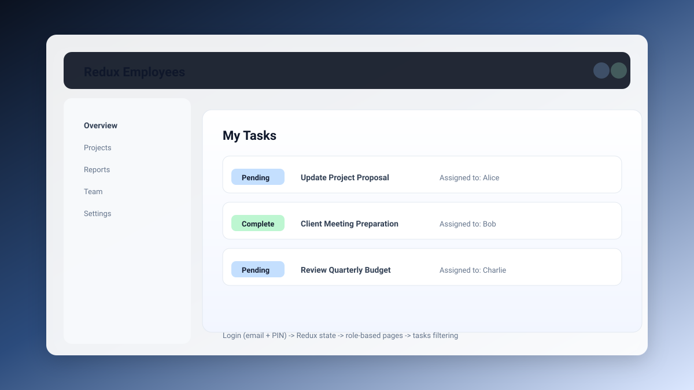

# Redux Employees (Vite + React)

Modern employee & task management app built with React, Redux Toolkit, and `json-server`. Users can log in using **email + PIN**, and the UI shows **role-based pages** (admin vs employee). Employees see **only their assigned tasks**.

## Output

## Tech Stack

- React (Vite)
- Redux Toolkit
- React Router
- Axios
- json-server (fake backend)
- Bootstrap UI

## Fast Setup (Run Locally)

1. Install dependencies
   - `bun install` (fast) or `npm install`
2. Start the backend (json-server)
   - `npx json-server --watch db.json --port 3000`
3. Start the frontend
   - `bun run dev` or `npm run dev`

Open the app at the Vite URL (usually `http://localhost:5173`).

## Login Details

Login validates credentials from `db.json` by matching:
- `email` + `pin`

Sample users:
- Admin: `qeqalico@mailinator.com` / `Pa$$w0rd`
- Employee: `wefawuke@mailinator.com` / `Pa$$w0rd!`

## Features

- Async login flow (Redux async thunk)
- Role-based routing (admin dashboard vs employee tasks)
- Fetch employees and tasks from `json-server`
- Employee task filtering by `employeeId`

